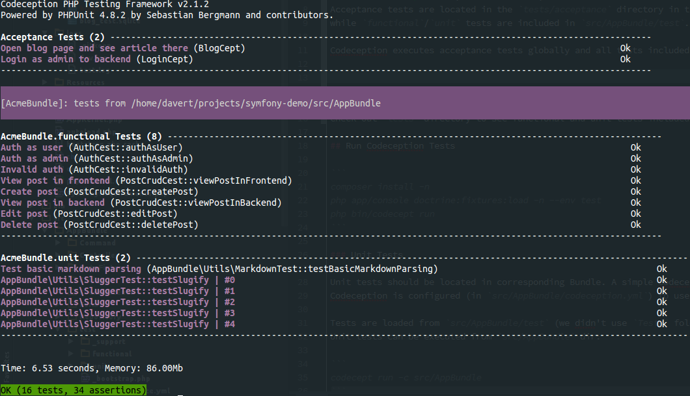

Symfony Demo Application
========================

[](https://travis-ci.org/Codeception/symfony-demo)

We use official "Symfony Demo Application" to demonstrate basics of Codeception testing.



There are **acceptance**, **functional**, and **unit** tests included.
Acceptance tests are located in the `tests/acceptance` directory in the root of a project,
while `functional`/`unit` tests are included in `src/AppBundle/test`.

Codeception executes acceptance tests globally and all tests included in bundles.

## Run Codeception Tests

```
composer install -n
php app/console doctrine:fixtures:load -n --env test
php app/consoler server:start
php bin/codecept run
```

### Unit and Functional Tests

Unit and Functional tests are supposed to be located in corresponding Bundle. A simple Codeception configuration was created `src/AppBundle`.
Codeception is configured (in `src/AppBundle/codeception.yml`) to use `app` directory for handling logs and data.

Tests are loaded from `src/AppBundle/test` (we didn't use `Tests` folder to separate symfony-demo original tests and tests of Codeception).
Unit tests can be executed from `src/AppBundle` dir:

```
php bin/codecept run -c src/AppBundle
```

## Acceptance Tests

Acceptance tests require web server to be started. They interact with application as regular user would do.
Ideally, this should include browser testing, however we use browser emulator PhpBrowser to do some basic testing.

```
php bin/codecept run acceptnace
```

-------

## Below goes official README of Symfony Demo Application:

---

The "Symfony Demo Application" is a reference application created to show how
to develop Symfony applications following the recommended best practices.

[](https://travis-ci.org/symfony/symfony-demo)

Requirements
------------

  * PHP 5.3 or higher;
  * PDO-SQLite PHP extension enabled;
  * and the [usual Symfony application requirements](http://symfony.com/doc/current/reference/requirements.html).

If unsure about meeting these requirements, download the demo application and
browse the `http://localhost:8000/check.php` script to get more detailed
information.

Installation
------------

First, install the [Symfony Installer](https://github.com/symfony/symfony-installer)
if you haven't already. Then, install the Symfony Demo Application executing
this command anywhere in your system:

```bash
$ symfony demo

# if you're using Windows:
$ php symfony demo
```

If the `demo` command is not available, update your Symfony Installer to the
most recent version executing the `symfony self-update` command.

> **NOTE**
>
> If you can't use the Symfony Installer, download and install the demo
> application using Git and Composer:
>
>     $ git clone https://github.com/symfony/symfony-demo
>     $ cd symfony-demo/
>     $ composer install

Usage
-----

If you have PHP 5.4 or higher, there is no need to configure a virtual host
in your web server to access the application. Just use the built-in web server:

```bash
$ cd symfony-demo/
$ php app/console server:run
```

This command will start a web server for the Symfony application. Now you can
access the application in your browser at <http://localhost:8000>. You can
stop the built-in web server by pressing `Ctrl + C` while you're in the
terminal.

> **NOTE**
>
> If you're using PHP 5.3, configure your web server to point at the `web/`
> directory of the project. For more details, see:
> http://symfony.com/doc/current/cookbook/configuration/web_server_configuration.html
